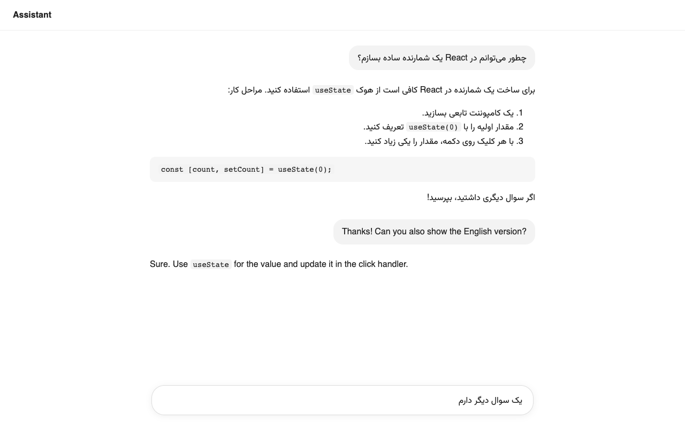

# Dynamic RTL

Shows Persian and Arabic text right to left, in the Vazirmatn font, on any website. Works with AI chats (ChatGPT, Claude, Gemini and others), X, Instagram and any page that mixes English with Persian or Arabic.

[](#install)
[](LICENSE)

<p>
  <a href="https://github.com/soroush5/Dynamic-RTL/releases/latest/download/dynamic-rtl-chrome-latest.zip"></a>
  <a href="https://github.com/soroush5/Dynamic-RTL/releases/latest/download/dynamic-rtl-firefox-latest.zip"></a>
  <a href="https://github.com/soroush5/Dynamic-RTL/releases/latest/download/dynamic-rtl-safari-latest.zip"></a>
</p>

[فارسی](README.fa.md)



## What it does

- Finds Persian or Arabic text as the page loads and as new content streams in, and flips just that paragraph, list item or table cell to right to left.
- Text is marked before the browser paints it, so pages open already right to left with the font in place. No flash.
- Persian letters use Vazirmatn. English words inside the same paragraph keep the site's own font.
- Mostly English paragraphs with a Persian word stay left to right. A Persian sentence that starts with an English word still goes right to left.
- Code, `pre` blocks and URLs keep their own direction.
- Inputs, text boxes and chat composers (ProseMirror, Lexical, Quill and plain `contenteditable`) get per-line direction once you type Persian, so mixed lines each align correctly.
- Pages that are already right to left (`lang="fa"`, `dir="rtl"` and so on) are left alone unless you turn the site on.

## What's new in 4.0

- Much lighter. On a page with no Persian or Arabic the script does one native text check and goes quiet. Measured against 3.2 it uses 2 to 9 times less script time (see [Performance](#performance)).
- The font no longer loads late. It is registered at `document_start` and warmed up the moment Arabic script appears.
- Smarter direction: decided per block from the mix of letters, lists get mirrored padding so markers stay inside, centered text stays centered, flex rows with icons are not flipped.
- Shadow DOM and streamed chat replies are followed without re-reading styles on every token.
- New minimal popup and settings page, with dark mode.
- Toggling a site back to its default removes the rule instead of storing it.
- Tested on 150+ real sites. See [Tests](#tests).

## Install

Download the zip for your browser from the [Releases page](https://github.com/soroush5/Dynamic-RTL/releases) (also kept in [`resources/`](resources)).

**Chrome, Edge, Brave, Arc, Opera**

1. Unzip `dynamic-rtl-chrome-v4.0.zip`.
2. Open `chrome://extensions` and turn on Developer mode.
3. Click Load unpacked and pick the folder.

**Firefox** (128 or newer)

- Temporary: open `about:debugging#/runtime/this-firefox`, click Load Temporary Add-on and pick `manifest.json` inside the unzipped folder. It stays until Firefox restarts.
- Permanent on Developer Edition, Nightly or ESR: set `xpinstall.signatures.required` to `false` in `about:config`, rename the zip to `.xpi` and drop it on Firefox.

**Safari** (26 or newer)

Unzip `dynamic-rtl-safari-v4.0.zip`, then Settings, Developer, Add Temporary Extension and pick the folder. Enable it under Settings, Extensions. It unloads when Safari quits.

## Use

- Click the toolbar icon to turn the current site on or off. The icon is gray where it is off.
- Shortcut: Ctrl+Shift+Y (Command+Shift+Y on Mac), or right-click a page.
- Settings: turn it on for all sites or only the ones you choose, upload your own font, and manage the site list (search, import, export).

A rule for a domain also covers its subdomains. To keep part of your own page untouched, add `data-dynrtl-skip` to it.

## Performance

The content script is built to cost nothing on pages that have no Persian or Arabic:

- While the page is parsing, one text walker follows the parser instead of reading every DOM mutation.
- A single native `textContent` check skips pages with no Arabic script at all. Shadow roots are found with native XPath and CSS queries.
- All work runs in `requestAnimationFrame`, right before paint, capped at 6 ms per frame and about 12% of a core over time. Hidden tabs do nothing.
- Style reads happen once per frame before any write. Blocks already marked are re-checked from their text alone.
- The font file is only fetched when a page actually has Arabic script.
- The background worker sleeps. Pages only message it when their state differs from the default icon.

Main-thread script time added by the extension, median of 7 loads (`tests/bench.py`, Chromium, Apple M-series):

| Page | 3.2 | 4.0 |
| --- | --- | --- |
| English only, 3,000 articles | 41.2 ms | 4.7 ms |
| Wikipedia, Persian language article | 44.1 ms | 13.9 ms |
| Wikipedia, United States (huge) | 67.2 ms | 31.0 ms |
| Wikipedia, Hafez | 13.6 ms | 7.6 ms |
| Telegram channel preview | 5.7 ms | 4.1 ms |

## Privacy

No network requests, no analytics, nothing leaves your browser. Settings sync through your browser account if sync is on; an uploaded font stays on the device. See [PRIVACY.md](PRIVACY.md).

## Project layout

```
src/            the extension source (one copy for all browsers)
scripts/build.sh    builds chrome/, firefox/ and safari/ from src/ and zips them
chrome/ firefox/ safari/    generated, ready to load unpacked
tests/          browser tests (Playwright)
resources/      release zips
```

Edit files in `src/`, then run `./scripts/build.sh`.

## Tests

Needs Python with Playwright and its Chromium (`pip install playwright && playwright install chromium`).

```bash
./scripts/build.sh --no-zip
python3 tests/core.py      # behavior on local pages
python3 tests/sites.py     # 150+ real sites, AI chats and big sites
python3 tests/bench.py none chrome
python3 tests/shots.py     # screenshots for the store
```

Latest real-site results: [tests/SITES.md](tests/SITES.md) (153 of 153 pass, median 4.7 ms of script time per site).

`tests/sites.py` only reads pages. It adds a sample Persian reply to the DOM, types into the main input without sending, and checks direction, font (down to the glyphs Chrome actually drew), lists, code and inputs. It never signs in or submits anything.

## Credits

- Developer: [soroush5](https://github.com/soroush5)
- Font: [Vazirmatn](https://github.com/rastikerdar/vazirmatn) by Saber Rastikerdar, SIL Open Font License 1.1

## License

MIT. See [LICENSE](LICENSE).
